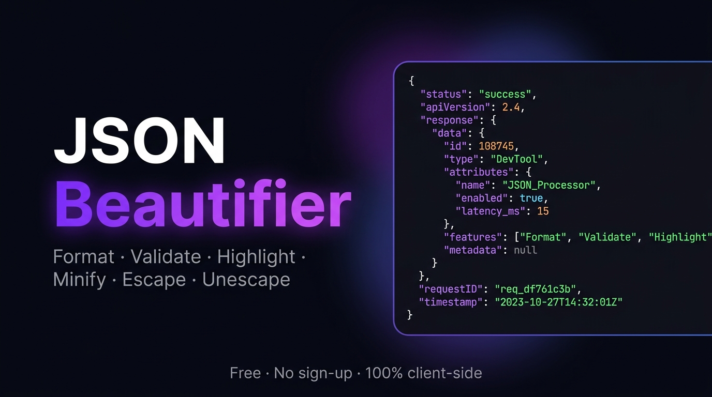
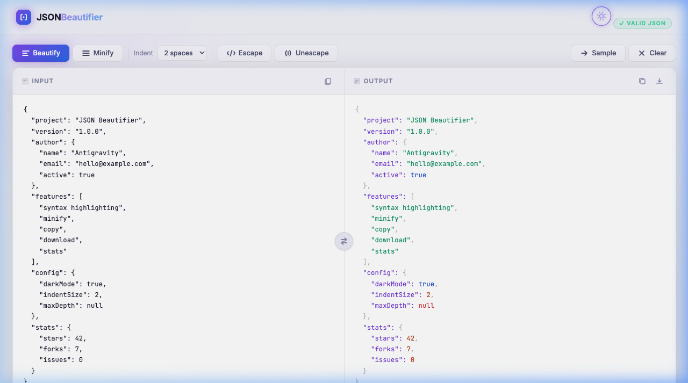
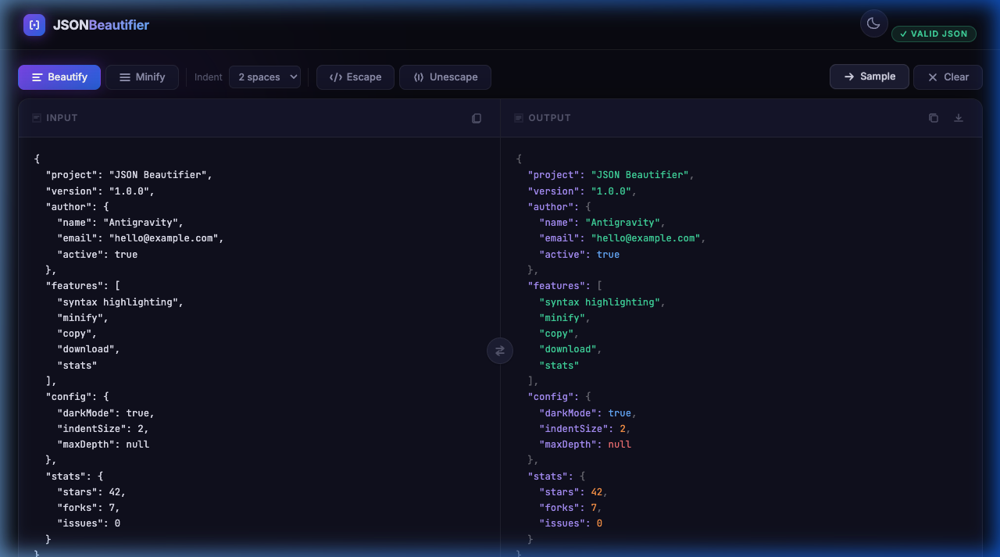

<div align="center">



<br /><br />

# JSON Beautifier

**A fast, free, beautiful JSON formatter — 100% client-side.**

[](https://bordia98.github.io/JsonBeautifier/)
[](LICENSE)
[](index.html)
[](package.json)

[**→ Open Live App**](https://bordia98.github.io/JsonBeautifier/)

</div>

---

## ✨ Features

| Feature | Description |
|---|---|
| 🎨 **Syntax Highlighting** | Keys, strings, numbers, booleans and null each get their own colour |
| ⚡ **Live Auto-Format** | JSON is beautified as you type (debounced) |
| 📐 **Minify** | Collapse to a single compact line |
| 🔡 **Escape / Unescape** | Wrap raw text as a JSON string literal, or decode one |
| 📊 **JSON Stats** | Key count, max nesting depth, file size, root type |
| 📋 **Copy to Clipboard** | One click to copy the formatted output |
| ⬇️ **Download** | Save the result as a `.json` file |
| 🖱️ **Drag & Drop** | Drop a `.json` file directly onto the input |
| 🔄 **Swap Panels** | Push formatted output back to the input |
| ⌨️ **Keyboard Shortcut** | `Ctrl / ⌘ + Enter` to beautify |
| 🌙☀️ **Dark / Light Theme** | Toggles with a single click; preference is saved |
| ✅ **Error Messages** | Shows the exact parse error with clear highlighting |
| 🔒 **100% Private** | Nothing is ever sent to a server or stored anywhere |

---

## 🚀 Getting Started

No build step, no dependencies, no server needed.

```bash
# Clone the repo
git clone https://github.com/bordia98/JsonBeautifier.git
cd JsonBeautifier

# Open directly in your browser
open index.html          # macOS
start index.html         # Windows
xdg-open index.html      # Linux
```

Or just visit the live site: **[bordia98.github.io/JsonBeautifier](https://bordia98.github.io/JsonBeautifier/)**

---

## 🗂️ Project Structure

```
JsonBeautifier/
├── index.html      # App shell — semantic HTML, all SEO meta tags
├── style.css       # Design system — dark/light themes, animations, responsive
├── app.js          # All logic — parsing, highlighting, stats, interactions
├── og-image.png    # Social preview image (Open Graph / Twitter Card)
├── robots.txt      # Search engine crawl rules
├── sitemap.xml     # XML sitemap for discoverability
└── LICENSE         # MIT License
```

---

## 🛠️ How It Works

Everything runs in the browser with zero network requests after the initial page load.

```
User types JSON
      │
      ▼  (350 ms debounce)
JSON.parse()  ──── error ──→  Error bar with message
      │
      ▼  success
JSON.stringify(parsed, null, indent)
      │
      ▼
Syntax highlighter (regex tokeniser)
      │
      ▼
<pre> output with <span class="tok-*"> tokens
```

The syntax highlighter is a lightweight regex tokeniser — no external libraries — which keeps the bundle size at **~15 KB** total.

---

## 📸 Screenshots

<table>
  <tr>
    <td align="center"><b>☀️ Light Mode</b></td>
    <td align="center"><b>🌙 Dark Mode</b></td>
  </tr>
  <tr>
    <td></td>
    <td></td>
  </tr>
</table>

---

## 🌐 Deploying to GitHub Pages

1. Push this repo to GitHub.
2. Go to **Settings → Pages**.
3. Under *Branch*, choose `main` and folder `/  (root)`.
4. Click **Save** — your site will be live at `https://bordia98.github.io/JsonBeautifier/` in ~1 minute.

No CI/CD needed — it's just static files.

---

## 🤝 Contributing

Contributions, issues and feature requests are welcome!

1. Fork the repository
2. Create your branch: `git checkout -b feature/my-new-feature`
3. Commit your changes: `git commit -m 'Add some feature'`
4. Push to the branch: `git push origin feature/my-new-feature`
5. Open a Pull Request

Please make sure your code follows the existing style (vanilla HTML/CSS/JS, no frameworks or build tools).

---

## 📄 License

Distributed under the **MIT License**. See [`LICENSE`](LICENSE) for more information.

---

<div align="center">

Made with ❤️ by [bordia98](https://github.com/bordia98) · No data is ever stored or sent anywhere

</div>
